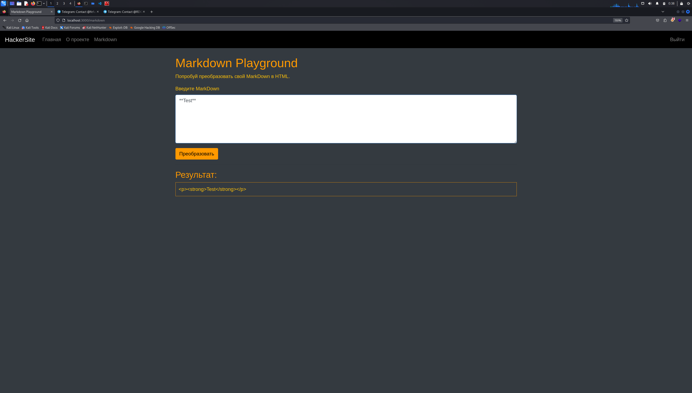
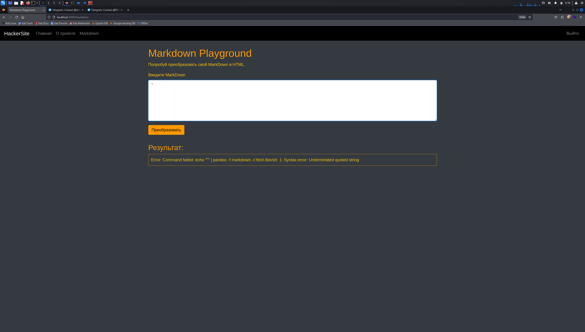
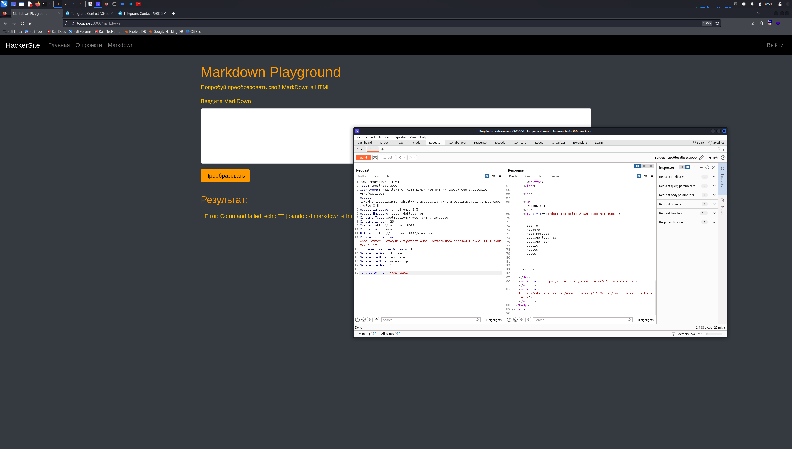
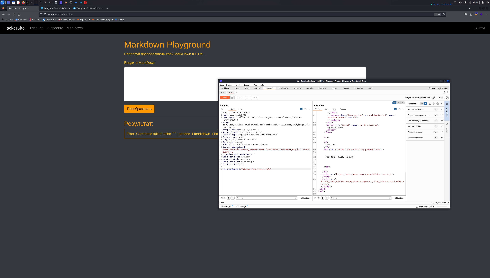

# Hackersite

## Описание:


| Название | Сложность | Автор |
|------|--------|--------|
| Hackesite | Medium |[@MrNansy](https://t.me/MrNansy) |

## TLDR

CMDi via **Newline injection**  

---
## Решение:

## 1. Лендинг

На лендинге видим главную страницу с функционалом регистрации и авторизации:  


Проходим эту процедуру

После авторизации обращаемся к эндпоинту `/markdown`, где можем конвертировать markdown в html


 
Базовые проверки позволят нам вызвать ошибку и получть информацию о выполняемом пайплайне: `echo "<input>" | pandoc ...`



Все сводится к CMD-инъекции, осталось понять, как ее выполнить. Подбирая нагрузку для CMDi в таком пайплайне, можно попробовать выполнить инъекцию newline-символа: `"%0a\"` – она не вызывает ошибок, но и вывода не возвращает


Далее попробуем выполнить инъекцию команды после newline – `"%0als%0a\"`



Успешная инъекция связана с тем, что `%0a` позволяет «разорвать» команду. Shell воспринимает это как:
  ```bash
  echo "..."
  ls
  echo "..."
  | pandoc ...
  ```

Остается лишь найти flag.txt в `/tmp`: `%0als+/tmp%0a\`


Попытка прочитать файл через `cat` даст понять, что `cat` фильтруется: 


Можем воспользоваться, например, `head`:



## Flag:
rdg{n3wl1n3_m4y_l34d_t0_rc3}
